# AI Data Analyst Agent — Full Implementation Plan

Evolving the existing Text-to-SQL project into the complete **Autonomous AI Data Analyst Agent** described in `CHANGES.md`.

---

## Gap Analysis: Current State vs. Target Vision

| # | Component (from CHANGES.md) | Current Status | Gap |
|---|---|---|---|
| 1 | **Agent Pipeline (Multi-step Reasoning)** | Partial — Single LLM call with few-shot + RAG context. No intent extraction, no query decomposition. | Need Steps 1-2 (Intent, Decomposition), Step 8 (Insight Generation) |
| 2 | **Backend Architecture (Modular FastAPI)** | Partial — Has `api/routes/`, `agent/`, `db/`, `model/`. Missing `services/` layer and `agents/orchestrator.py` structure. | Need service layer abstraction, dedicated orchestrator |
| 3 | **RAG System (Schema Intelligence)** | ✅ Working — ChromaDB + semantic layer + embedding retrieval | Minor: could add relationship metadata to embeddings |
| 4 | **Self-Healing Engine** | ✅ Working — 2-retry loop with LLM-based SQL fix | Minor: could add structured error classification |
| 5 | **Visualization Engine** | Code exists but **commented out** in `sql_chain.py:276-278` for latency reasons | Need to activate + wire to frontend `ChartDisplay.tsx` |
| 6 | **Memory System** | ❌ Missing — Only in-memory response cache (dict with TTL) | Need persistent vector memory for past queries |
| 7 | **Metrics & Evaluation Layer** | Partial — `QueryLog` table exists with latency/tables_used/error | Need aggregated metrics endpoint (success rate, avg latency, retry count) |
| 8 | **Frontend (Chat + Dashboard)** | Partial — Chat interface works with SSE streaming, schema explorer, approval modal | Need: insight panel, chart display wiring, dashboard view |
| 9 | **HITL Guard** | ✅ Working | No gap |
| 10 | **Deployment** | ✅ Has `infra/` with nginx, systemd, setup scripts | Minor: no Docker/docker-compose yet |
| 11 | **Query Expansion** | Code exists but **commented out** in `sql_chain.py:165-173` for latency reasons | Needs activation with faster model |

---

## User Review Required

> [!IMPORTANT]
> **LLM Cost vs. Latency Tradeoff**: Several features (visualization suggestion, query expansion, insight generation) each add an additional LLM call (~3-4s latency each). We can either:
> - **(A)** Run them in **parallel** after SQL execution using `asyncio.gather()` — adds ~4s total instead of ~12s
> - **(B)** Use a **faster/cheaper model** (e.g. `gemini-2.0-flash-lite`) for these secondary calls while keeping the main SQL generation on `gemini-2.5-flash`
> - **(C)** Make them **optional/toggleable** from the frontend (user clicks "Generate Insights" button)
>
> **I recommend Option A + B combined** — parallel calls on a fast model. Which approach do you prefer?

> [!WARNING]
> **Memory System Storage**: The CHANGES.md calls for "vector memory" to store past queries. Options:
> - **(A)** Reuse **ChromaDB** — add a second collection `query_memory` alongside `schema_index`
> - **(B)** Use **PostgreSQL with pgvector** — keeps everything in one database
> - **(C)** Simple **PostgreSQL text search** on existing `query_log` table (no vectors, much simpler)
>
> Option A is simplest since ChromaDB is already integrated. Option C is the fastest to implement but less semantically powerful.

## Open Questions

1. **Query Decomposition Scope**: The CHANGES.md envisions breaking complex questions like "Why did revenue drop last month?" into multiple sub-queries. Should we implement a full **multi-query orchestrator** (executes 3-4 SQL queries, synthesizes results), or a simpler **single-query with enriched context** approach where the LLM is given more schema context to write a single comprehensive query?

2. **Dashboard vs. Chat-Only**: The CHANGES.md mentions a "hybrid chat + dashboard" frontend. Do you want a separate **dashboard page** (with summary cards, charts, recent queries), or should we enhance the existing **chat interface** with inline charts, insights, and a history sidebar?

3. **Redis**: The deployment architecture mentions Redis for caching. The current in-memory dict cache works fine for single-instance. Do you want to add Redis now, or keep the in-memory cache for simplicity?

4. **Docker**: Should we add `Dockerfile` + `docker-compose.yml` in this iteration, or defer to a later phase?

---

## Proposed Changes

### Phase 1: Activate Dormant Features & Quick Wins
*Estimated effort: ~2-3 hours. Unlocks visualization, query expansion, and metrics — features whose code already exists.*

---

#### Agent Pipeline Enhancements

##### [MODIFY] [sql_chain.py](file:///c:/Users/ARTH%20ARVIND/Desktop/PROJECTS/text-to-sql/agent/sql_chain.py)
- **Uncomment and activate visualization suggestion** (line 276-278) — run it in parallel with result assembly using `asyncio.gather()`
- **Uncomment and activate query expansion** (line 165-173) — run it before RAG retrieval
- **Add a secondary fast LLM** (`gemini-2.0-flash-lite`) for visualization + expansion calls so they don't impact main SQL generation latency
- **Add `retry_count` tracking** to the response payload (count how many self-healing retries were needed)
- **Include `insight` field** in final response — a brief natural-language summary of the query results generated by the fast LLM

##### [NEW] [agent/insight_engine.py](file:///c:/Users/ARTH%20ARVIND/Desktop/PROJECTS/text-to-sql/agent/insight_engine.py)
- New module: takes SQL results + original question → generates a 2-3 sentence natural language insight
- Uses the fast LLM model for low latency
- Prompt template: "Given this question and these results, provide a brief, data-driven insight"

---

#### Metrics & Evaluation API

##### [NEW] [api/routes/analytics.py](file:///c:/Users/ARTH%20ARVIND/Desktop/PROJECTS/text-to-sql/api/routes/analytics.py)
- `GET /api/analytics` — returns aggregated metrics from `query_log`:
  - Total queries processed
  - SQL success rate (queries without errors / total)
  - Average latency (ms)
  - Average retry count (new field)
  - Most queried tables
  - Queries over last 7 days (time series)

##### [MODIFY] [model/schema.py](file:///c:/Users/ARTH%20ARVIND/Desktop/PROJECTS/text-to-sql/model/schema.py)
- Add `retry_count = Column(Integer, nullable=True, default=0)` to `QueryLog`
- Add `success = Column(Boolean, nullable=True, default=True)` to `QueryLog`

##### [MODIFY] [api/main.py](file:///c:/Users/ARTH%20ARVIND/Desktop/PROJECTS/text-to-sql/api/main.py)
- Register the new `analytics` router

---

#### Health Endpoint Fix

##### [MODIFY] [api/routes/health.py](file:///c:/Users/ARTH%20ARVIND/Desktop/PROJECTS/text-to-sql/api/routes/health.py)
- Replace "OpenAI key check" with "Gemini key check" — the current code checks for `OPENAI_API_KEY` which is no longer used; should check `GEMINI_API_KEY`

---

### Phase 2: Memory System & Intent Understanding
*Estimated effort: ~3-4 hours. Adds persistent query memory and basic intent classification.*

---

#### Memory System

##### [NEW] [agent/memory.py](file:///c:/Users/ARTH%20ARVIND/Desktop/PROJECTS/text-to-sql/agent/memory.py)
- **Query Memory Store**: Uses ChromaDB collection `query_memory`
  - `store_query(question, sql, results_summary)` — embed and store successful query+SQL pairs
  - `recall_similar(question, k=3)` — retrieve past similar queries and their SQL
- On each successful query execution, automatically store the question+SQL in memory
- When a new question arrives, check memory first — if a very similar question was asked before, use the cached SQL as a starting point (or return it directly)

##### [MODIFY] [agent/sql_chain.py](file:///c:/Users/ARTH%20ARVIND/Desktop/PROJECTS/text-to-sql/agent/sql_chain.py)
- Import and use `memory.recall_similar()` before RAG retrieval
- Inject similar past queries into the prompt as additional few-shot examples
- Call `memory.store_query()` after successful execution

---

#### Intent Understanding

##### [NEW] [agent/intent.py](file:///c:/Users/ARTH%20ARVIND/Desktop/PROJECTS/text-to-sql/agent/intent.py)
- **Intent Classifier**: Lightweight LLM call (fast model) to extract:
  - `entities`: tables/columns referenced (e.g., "revenue", "customers", "São Paulo")
  - `metrics`: what to measure (e.g., "total", "average", "trend")
  - `filters`: time ranges, status filters, geographic filters
  - `intent_type`: one of `aggregation`, `comparison`, `trend`, `lookup`, `complex`
- This metadata is injected into the SQL generation prompt for better accuracy
- For `complex` intent types, could trigger query decomposition (Phase 3)

##### [MODIFY] [agent/sql_chain.py](file:///c:/Users/ARTH%20ARVIND/Desktop/PROJECTS/text-to-sql/agent/sql_chain.py)
- Call intent classifier before SQL generation
- Use extracted entities to improve RAG retrieval (search for specific table names)
- Include intent metadata in the system prompt

---

### Phase 3: Query Decomposition & Orchestrator
*Estimated effort: ~4-5 hours. The most architecturally complex phase.*

---

#### Agent Orchestrator

##### [NEW] [agent/orchestrator.py](file:///c:/Users/ARTH%20ARVIND/Desktop/PROJECTS/text-to-sql/agent/orchestrator.py)
- **State Machine / Pipeline Orchestrator**: Replaces the monolithic `stream_query()` function
- Stages: `CLASSIFY_INTENT → RETRIEVE_CONTEXT → GENERATE_SQL → EXECUTE → VALIDATE → HEAL → INSIGHT → VISUALIZE`
- Each stage is a separate async function, making the pipeline testable and extensible
- For `complex` intent queries, adds a `DECOMPOSE` stage that:
  1. Breaks the question into 2-4 sub-questions
  2. Runs each sub-question through the pipeline
  3. Synthesizes results into a unified response with the LLM

##### [MODIFY] [agent/sql_chain.py](file:///c:/Users/ARTH%20ARVIND/Desktop/PROJECTS/text-to-sql/agent/sql_chain.py)
- Refactor: Extract helper functions (`_retrieve_schema`, `_generate_sql`, `_execute_and_heal`) into standalone async functions that the orchestrator calls
- Keep `stream_query()` as a backward-compatible wrapper that delegates to the orchestrator

##### [NEW] [agent/reasoning.py](file:///c:/Users/ARTH%20ARVIND/Desktop/PROJECTS/text-to-sql/agent/reasoning.py)
- **Query Decomposition Engine**: Takes a complex question + intent metadata
- Uses LLM to break it into ordered sub-queries
- Returns a `QueryPlan` with dependencies between sub-queries
- Example: "Why did revenue drop last month?" → `[total_revenue_this_month, total_revenue_last_month, revenue_by_category_comparison]`

---

#### Backend Services Layer

##### [NEW] [services/__init__.py](file:///c:/Users/ARTH%20ARVIND/Desktop/PROJECTS/text-to-sql/services/__init__.py)
##### [NEW] [services/llm_service.py](file:///c:/Users/ARTH%20ARVIND/Desktop/PROJECTS/text-to-sql/services/llm_service.py)
- Centralize LLM initialization, model selection, and token tracking
- Support multiple model tiers: `sql` (primary), `fast` (secondary), `embedding`
- Expose `agenerate()`, `astream()`, `embed()` methods

##### [NEW] [services/rag_service.py](file:///c:/Users/ARTH%20ARVIND/Desktop/PROJECTS/text-to-sql/services/rag_service.py)
- Wrap `retriever.py` + `memory.py` into a unified RAG service
- `get_context(question, intent)` → combines schema context + memory context + few-shot examples

##### [NEW] [services/sql_service.py](file:///c:/Users/ARTH%20ARVIND/Desktop/PROJECTS/text-to-sql/services/sql_service.py)
- Extract SQL execution + validation logic from `sql_chain.py`
- `execute(sql)`, `validate(sql, results)`, `fix(question, sql, error, schema)`

---

### Phase 4: Frontend Enhancements
*Estimated effort: ~3-4 hours. Wires the new backend features into the UI.*

---

#### Frontend Components

##### [MODIFY] [frontend/src/api.ts](file:///c:/Users/ARTH%20ARVIND/Desktop/PROJECTS/text-to-sql/frontend/src/api.ts)
- Add `getAnalytics()` API call for the metrics dashboard
- Update `QueryResponse` type to include `insight`, `retry_count`, and `visualization` fields

##### [MODIFY] [frontend/src/components/ChartDisplay.tsx](file:///c:/Users/ARTH%20ARVIND/Desktop/PROJECTS/text-to-sql/frontend/src/components/ChartDisplay.tsx)
- Wire the chart display to the `visualization` field from the query response
- Currently exists but may not be connected to the data flow

##### [NEW] [frontend/src/components/InsightPanel.tsx](file:///c:/Users/ARTH%20ARVIND/Desktop/PROJECTS/text-to-sql/frontend/src/components/InsightPanel.tsx)
- Displays the AI-generated natural language insight below the results table
- Styled as a subtle callout card with a "lightbulb" icon

##### [NEW] [frontend/src/components/MetricsDashboard.tsx](file:///c:/Users/ARTH%20ARVIND/Desktop/PROJECTS/text-to-sql/frontend/src/components/MetricsDashboard.tsx)
- Dashboard view showing:
  - Summary cards (total queries, success rate, avg latency)
  - Time-series chart of queries over last 7 days
  - Most queried tables bar chart
- Accessible via a toggle/tab in the sidebar

##### [MODIFY] [frontend/src/App.tsx](file:///c:/Users/ARTH%20ARVIND/Desktop/PROJECTS/text-to-sql/frontend/src/App.tsx)
- Add sidebar toggle between "Chat" and "Dashboard" views
- Pass `insight` and `visualization` data down to components

##### [MODIFY] [frontend/src/components/ChatWindow.tsx](file:///c:/Users/ARTH%20ARVIND/Desktop/PROJECTS/text-to-sql/frontend/src/components/ChatWindow.tsx)
- Render `InsightPanel` below `ResultsTable` for each answer message
- Render `ChartDisplay` when visualization data is available

---

### Phase 5 (Optional): Deployment & Infrastructure
*Deferred unless prioritized.*

##### [NEW] [Dockerfile](file:///c:/Users/ARTH%20ARVIND/Desktop/PROJECTS/text-to-sql/Dockerfile)
- Multi-stage build: Python backend + Node.js frontend build

##### [NEW] [docker-compose.yml](file:///c:/Users/ARTH%20ARVIND/Desktop/PROJECTS/text-to-sql/docker-compose.yml)
- Services: `api`, `postgres`, `chromadb`, optionally `redis`

---

## Implementation Priority

```mermaid
gantt
    title Implementation Phases
    dateFormat  X
    axisFormat %s hrs

    section Phase 1 - Quick Wins
    Activate Visualization     :a1, 0, 1
    Activate Query Expansion   :a2, 0, 1
    Insight Engine             :a3, 1, 2
    Analytics Endpoint         :a4, 1, 2
    Health Endpoint Fix        :a5, 0, 1

    section Phase 2 - Memory & Intent
    Memory System              :b1, 3, 5
    Intent Classifier          :b2, 3, 5

    section Phase 3 - Orchestrator
    Orchestrator FSM           :c1, 6, 9
    Query Decomposition        :c2, 7, 9
    Services Layer             :c3, 6, 8

    section Phase 4 - Frontend
    Insight Panel              :d1, 9, 10
    Chart Wiring               :d2, 9, 10
    Metrics Dashboard          :d3, 10, 12
```

---

## Verification Plan

### Automated Tests
- **Phase 1**: Run `uvicorn api.main:app` → test `/api/query/stream` with a sample question → verify response contains `visualization`, `insight`, and `retry_count` fields
- **Phase 1**: Test `GET /api/analytics` returns valid aggregated metrics
- **Phase 1**: Test `GET /api/health` checks for `GEMINI_API_KEY` instead of `OPENAI_API_KEY`
- **Phase 2**: Test memory store/recall round-trip with ChromaDB
- **Phase 3**: Test orchestrator with a complex question that triggers decomposition

### Manual Verification
- Visual check: query "What is total revenue by category?" → see chart rendered in frontend
- Visual check: query results show an insight summary below the data table
- Visual check: dashboard tab shows metrics cards and charts
- Latency check: parallel LLM calls should keep total latency under ~6s for a full pipeline (SQL + insight + visualization)
